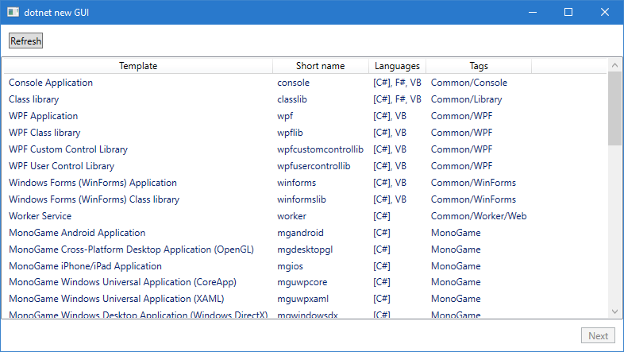

## What?
A basic GUI for `dotnet new`.

## Why?
The new project dialog in Visual Studio doesn't include .NET Core templates and I don't really like using the command line.

## How?
As far as I know there's no API for the dotnet template system, so this program uses `dotnet new` commands and parses the output.

## What's supported?
Using `dotnet new` to make new projects from templates.

The following options are supported:
* `--force`
* `--dry-run`
* `--name`
* `--output`
* `--language`
* `--framework`

The following are not currently supported:
* Installing, uninstalling or updating templates
* `--langVersion`
* Any other template options